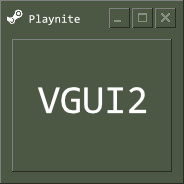
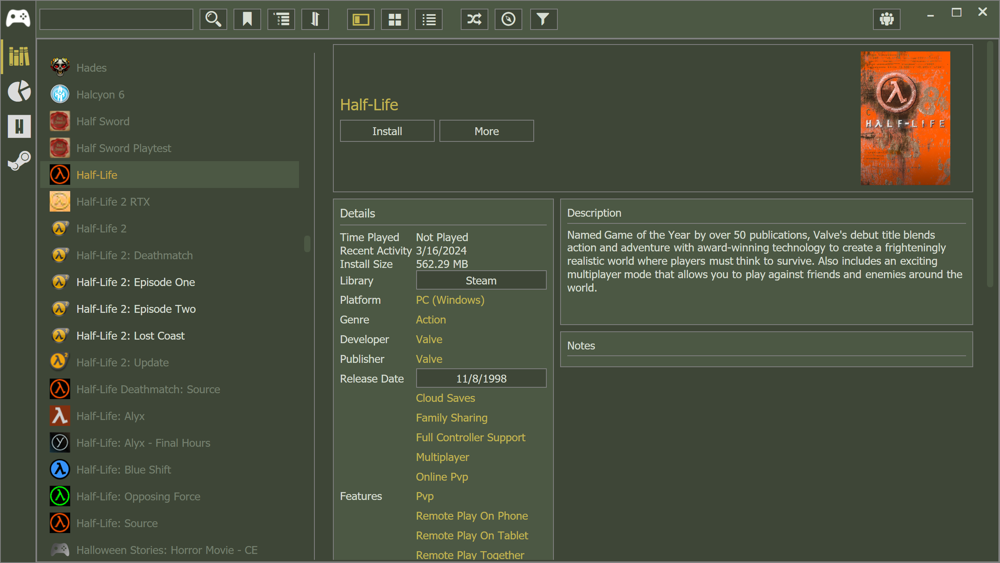
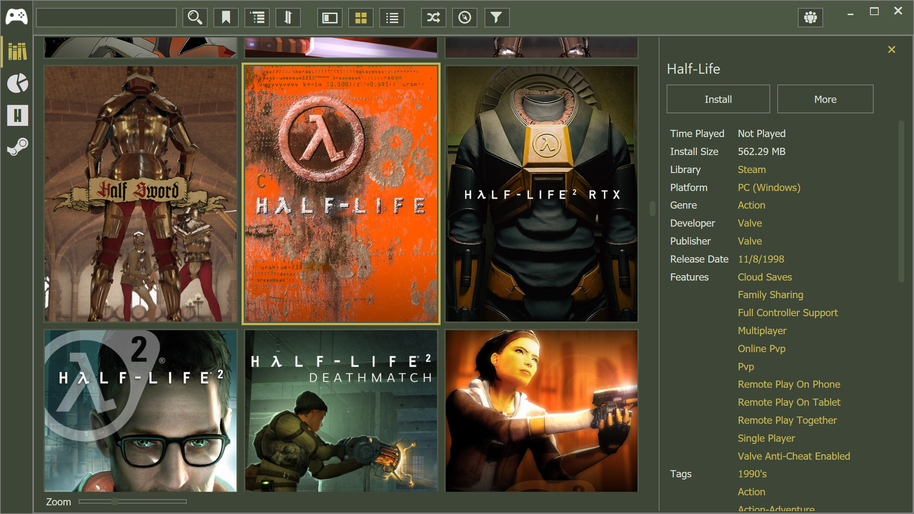
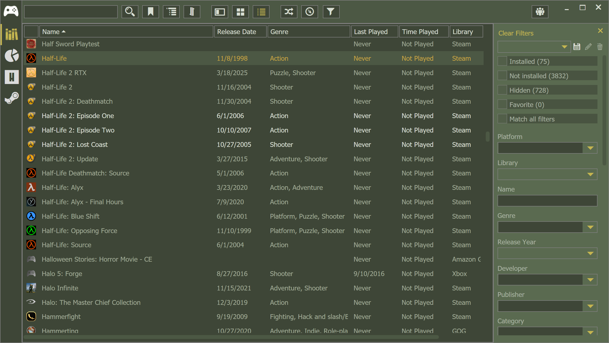
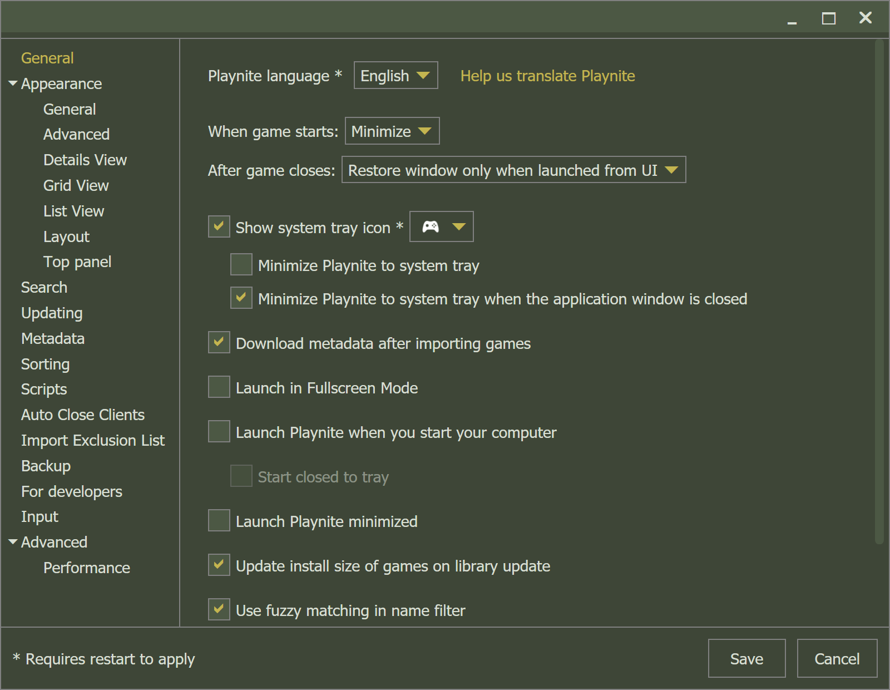

# Playnite-VGUI2

  

A Playnite Desktop theme inspired by the classic Valve VGUI aesthetic.

## Features

* VGUI-inspired color palette and visual styling
* Custom control templates and reusable theme resources
* Themed Library, Grid, List, Search, Details, Sidebar, and Panel views
* Custom game presentation elements and layouts
* Bundled fonts, icons, imagery, and HTML templates

## Screenshots

### Details View

### Grid View

### List View

### Settings

## Notes

Background images have been removed from the Details View to provide a more consistent experience across both Steam and non-Steam libraries.

## Downloads

Download the latest release here:

**https://github.com/Alexander-DeLarge/Playnite-VGUI2/releases**

## Installation instructions

Place the release in **%YOURPATH%\Playnite\Themes\Desktop** and select the theme in Playnite's application settings.

## Inspiration

Inspired by the OldSteam Theme by MapleAtMorning:

**https://github.com/MapleAtMorning/OldSteam-Theme**
